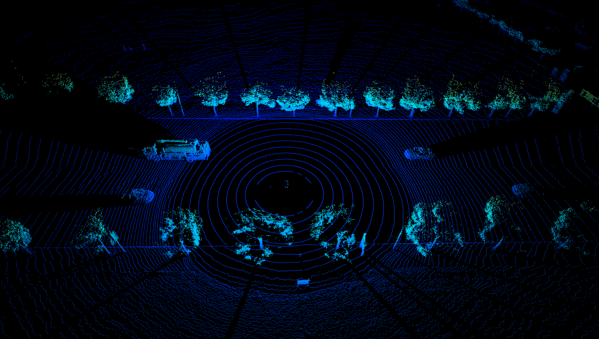
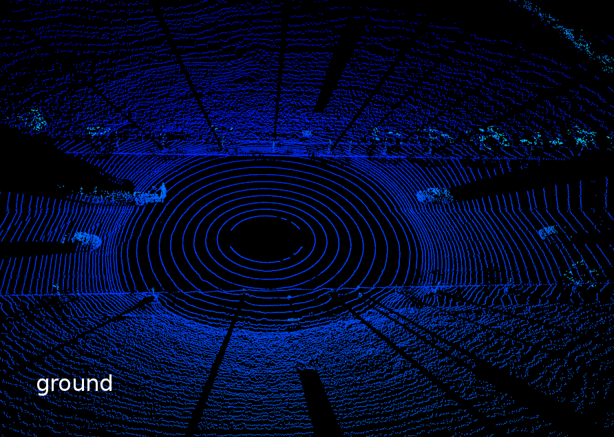
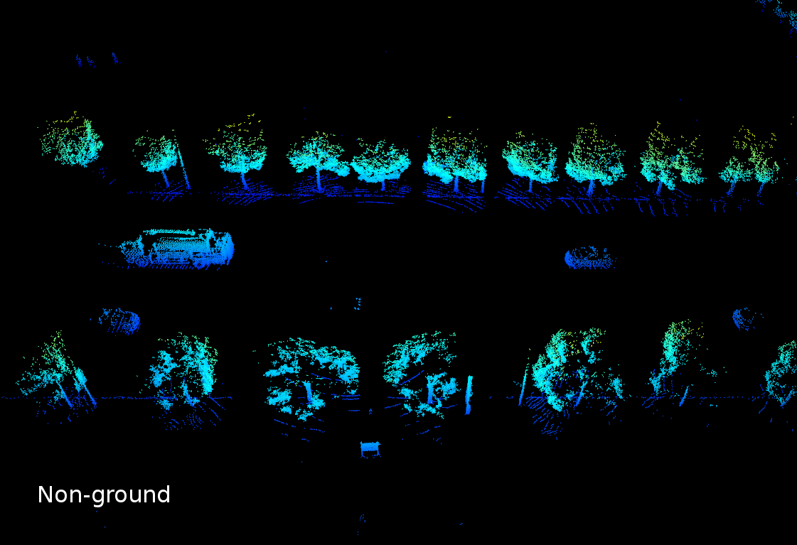
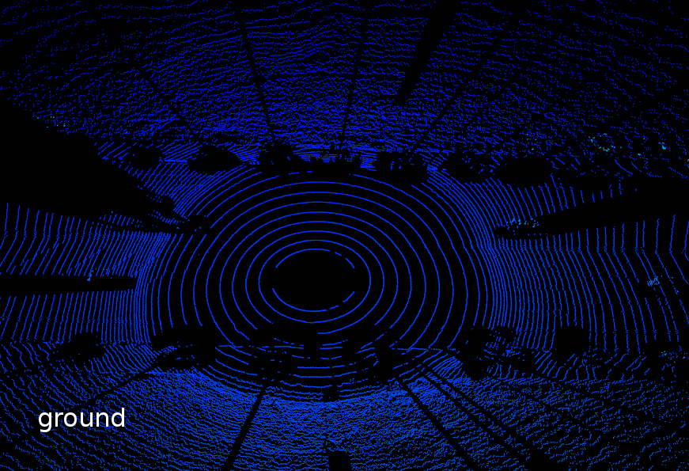
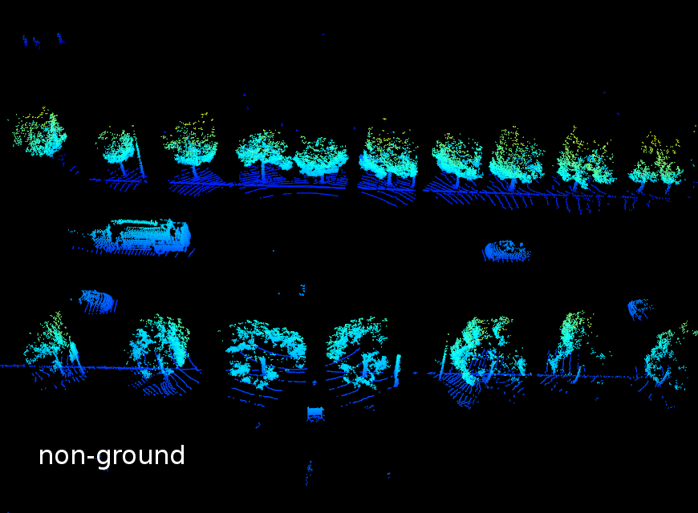
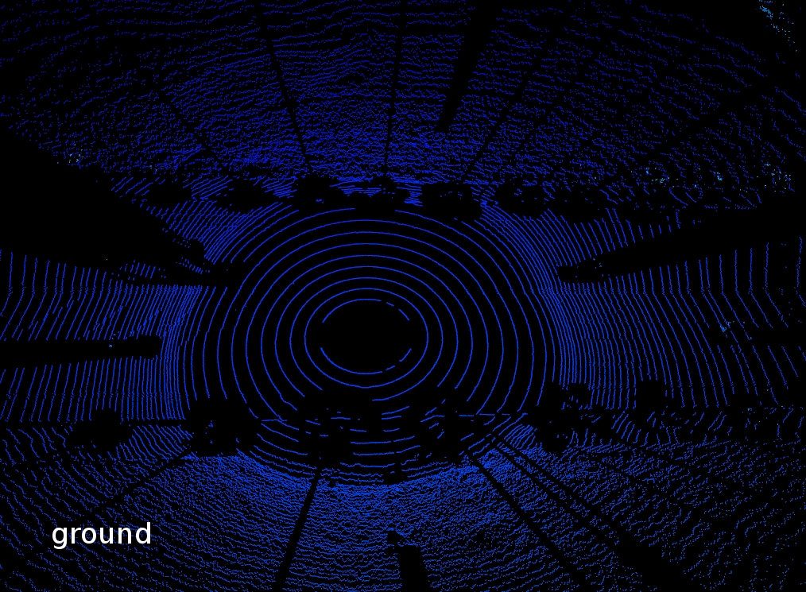
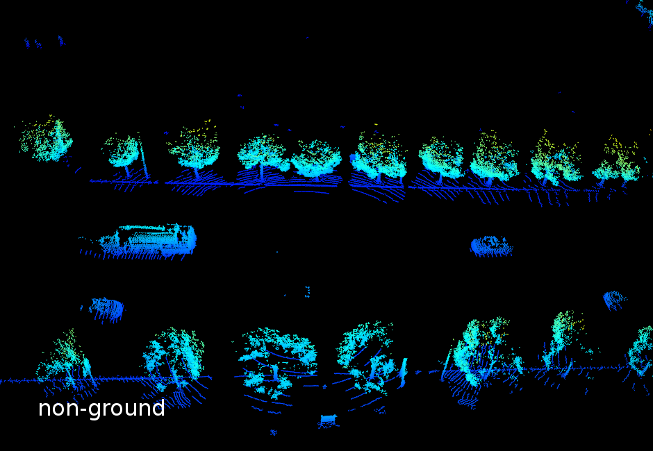

# Tests

## Ray ground filter

We implement a tool to extract ground and non-ground points by a ray ground filter. 

The original paper is: Fast segmentation of 3D point clouds for ground vehicles, in 2010 IEEE Intelligent Vehicles Symposium.
The websites that introduce the method include: [Autoware](https://gitlab.com/autowarefoundation/autoware.auto/AutowareAuto/-/blob/master/src/perception/filters/ray_ground_classifier/design/ray-ground-classifier-design.md), [Paopao SLAM](https://www.sohu.com/a/334672903_715754), [CSDN blog](https://blog.csdn.net/AdamShan/article/details/82901295).
The C++ version of original gay ground filter is from [here](https://github.com/AbangLZU/lidar_ground_filter).

Based on the original version, we add two refinements to include more object points, since the cloud provided by DeeCamp is much denser than other datasets.

To test the filter, first select the `refinement mode` [here](ray_ground_filter.py#L321-L323), then run:

```bash
python3 tools/tests/ray_ground_filter.py /path/to/test/cloud.bin
```

To process multiple cloud files in a folder and split them into ground clouds and non-ground clouds, please run:

```bash
python3 tools/tests/split_cloud_with_ground_filter.py /path/to/data/folder /path/to/output/folder
```

The results are shown as follows:

- Raw cloud


- Filtered by **original** ray ground filter



- With **sliding window** refinement:



- With **nearest neighbor** refinement:

