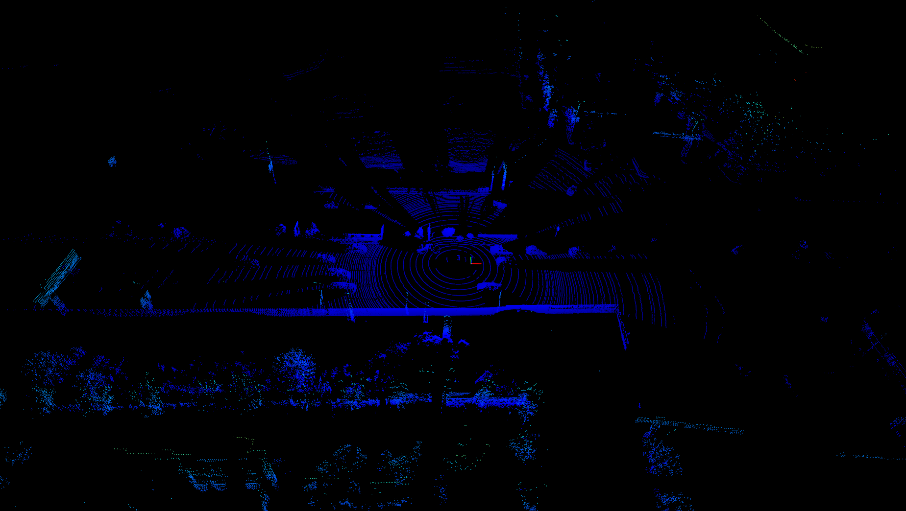
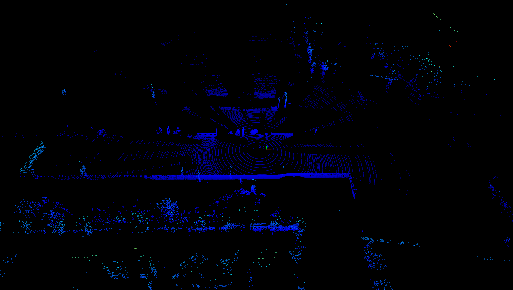
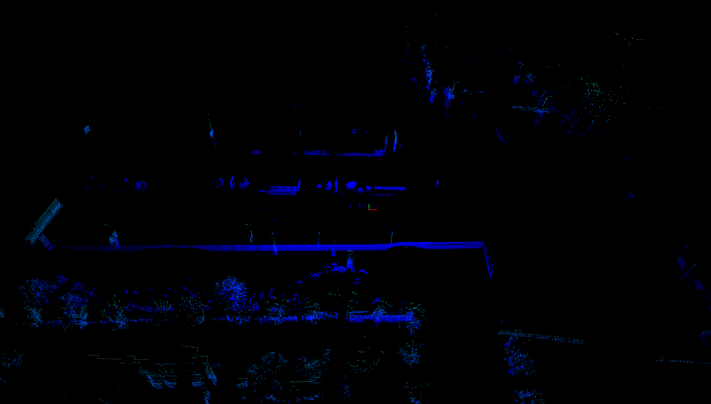
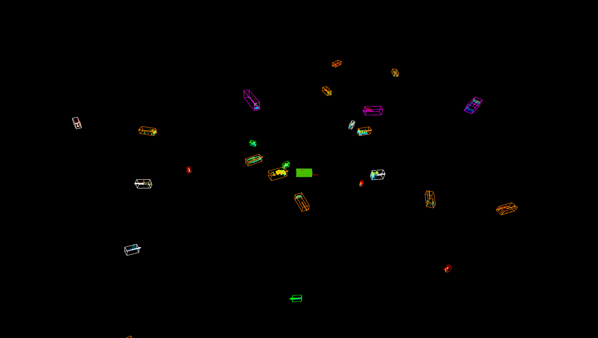
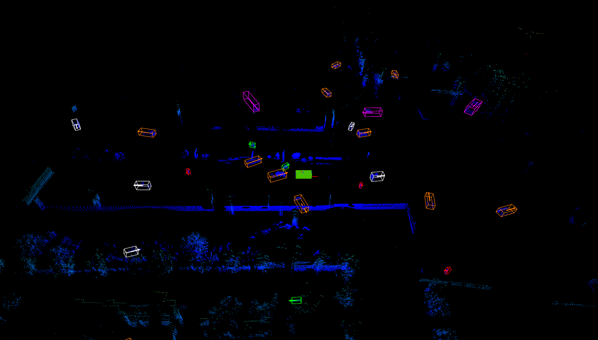

# Tests

## Ray ground filter

We implement a tool to extract ground and non-ground points by a ray ground filter. 

The original paper is: Fast segmentation of 3D point clouds for ground vehicles, in 2010 IEEE Intelligent Vehicles Symposium.
The websites that introduce the method include: [Autoware](https://gitlab.com/autowarefoundation/autoware.auto/AutowareAuto/-/blob/master/src/perception/filters/ray_ground_classifier/design/ray-ground-classifier-design.md), [Paopao SLAM](https://www.sohu.com/a/334672903_715754), [CSDN blog](https://blog.csdn.net/AdamShan/article/details/82901295).
The C++ version of original gay ground filter is from [here](https://github.com/AbangLZU/lidar_ground_filter).

Based on the original version, we add two refinements to include more object points, since the cloud provided by DeeCamp is much denser than other datasets.

To test the filter, first select the `refinement mode` [here](ray_ground_filter.py#L321-L323), then run:

```bash
python3 tools/tests/ray_ground_filter.py /path/to/test/cloud.bin
```

To process multiple cloud files in a folder and split them into ground clouds and non-ground clouds, please run:

```bash
python3 tools/tests/split_cloud_with_ground_filter.py /path/to/data/folder /path/to/output/folder
```

The results are shown as follows:

- Raw cloud


- Filtered by **original** ray ground filter


- With **sliding window** refinement:


- With **nearest neighbor** refinement:


## Scene Generator

We design a tool to generate simulated scenes by combining objects from labeled dataset and 
the original non-ground points after croping the original objects.

To test the generator, first modify the `data_folder`, `objects_folder` and `label_file` [here](random_scene_generation.py#L493-L495), then run:

```bash
python3 tools/tests/random_scene_generation.py
```

To process multiple scenes at the same time and save their clouds and a single label file,
first modify the `data_folder`, `objects_folder` and `label_file` [here](generate_simulated_scenes.py#L31-L33),
then run:

```bash
python3 tools/tests/generate_simulated_scenes.py
```

The main procedure includes:

1. Load a frame with its label info


2. Remove labeled objects


3. Remove ground points


4. Random select and place objects from pre-collected objects


5. Add non-ground points


**Remarks:**

- The objects are resampled by LiDAR sensor after beening placed to a new random location.
- The objects are added from close to far, and only the collision-free objects are remained.
- Those non-ground points occluded by the objects are removed.